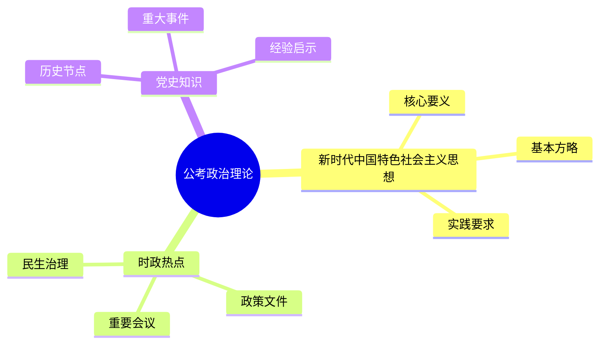

# 公考政治理论视频学习整理

## 使用定位

这个 skill 用于把视频内容转成适合公考政治理论复习的学习材料。处理视频时，不只做普通摘要，而要围绕“政治理论考点、时间顺序、事件链条、政策背景、关键词和可复习结构”进行整理。

适用内容包括：
- 公考政治理论课程视频
- 时政热点解读
- 党史、新中国史、改革开放史、社会主义发展史相关视频
- 新时代中国特色社会主义思想、政府工作报告、重要会议精神讲解
- 马克思主义基本原理、中国特色社会主义理论体系、宪法与国家制度相关课程

## 工作流程

### 1. 获取视频文字

优先提取官方字幕或 CC 字幕；没有字幕时，再使用语音转文字。

下载视频或字幕：

```bash
python3 {baseDir}/scripts/download.py --url "VIDEO_URL" --output "{baseDir}/output"
```

B站视频如需登录字幕，可尝试浏览器 cookies：

```bash
python3 {baseDir}/scripts/download.py --url "VIDEO_URL" --output "{baseDir}/output" --cookies-from-browser chrome
```

提取字幕文本：

```bash
python3 {baseDir}/scripts/extract_subtitles.py --input-dir "{baseDir}/output" --output "{baseDir}/output/transcript.txt"
```

无字幕时转写音频，并保留时间戳：

```bash
python3 {baseDir}/scripts/transcribe.py --input-dir "{baseDir}/output" --output "{baseDir}/output/transcript.txt" --timestamps
```

如果支持本地 Whisper，可使用：

```bash
python3 {baseDir}/scripts/transcribe.py --input-dir "{baseDir}/output" --output "{baseDir}/output/transcript.txt" --local --model turbo --timestamps
```

处理政治理论课程时，必须尽量保留时间戳，因为后续要按照“时间-事件-考点”建立事件链。

## 输出原则

### 1. 转成“标题 + note + 内容”的学习结构

视频文字整理后，默认输出为以下结构：

```markdown
# 标题

> note：用 1-3 句话说明这一节的核心考点、考试价值或易混点。

正文内容：
用报告式、学习笔记式语言整理视频内容，不照搬口语，不写成机械摘要。
```

每个知识块都应包含：
- **标题**：概括该部分讲什么，尽量使用公考政治理论常见表述。
- **note**：指出这一部分为什么重要，可能对应什么题型、考点或易错点。
- **内容**：展开解释背景、概念、事件、意义、影响和记忆线索。

### 2. 首页可加入相关图片装饰

当用户要求生成 Markdown、Word、PPT 或可视化学习材料时，首页应放一张与主题切合的图片作为装饰。

选图原则：
- 主题相关，例如人民大会堂、国旗、党史纪念馆、宪法、会议现场、城市治理、基层服务等。
- 风格正式、克制，适合公考政治理论材料。
- 不使用与主题无关的抽象装饰图。
- 如果使用网络图片，应尽量选官方、公开、稳定来源，并在材料中注明来源。

### 3. 以时间和事件为主线

公考政治理论整理时，要优先梳理“时间顺序”和“事件链条”，不要只罗列观点。

输出时应重点整理：
- 关键年份、日期、会议、文件、政策和历史节点
- 事件发生的先后顺序
- 前因、过程、结果、意义
- 事件之间的联系，例如“提出-发展-完善-落实”

推荐结构：

```markdown
## 时间线

| 时间 | 事件 | 核心内容 | 公考记忆点 |
|---|---|---|---|
| 1978年 | 改革开放启动 | 开启改革开放和社会主义现代化建设新时期 | 常与十一届三中全会联系 |

## 事件链

事件A -> 事件B -> 政策形成 -> 制度完善 -> 现实意义
```

整理事件链时，语言要体现因果关系，而不是简单堆叠：
- “由于……因此……”
- “在此基础上……”
- “这一变化推动了……”
- “其现实意义主要体现在……”

### 4. 根据用户提问补充对应知识点

如果用户围绕视频内容继续提问，回答时不能只复述视频，应结合公考政治理论知识体系补充相关考点。

补充时遵循：
- 先回答用户问题
- 再补充相关知识点
- 最后给出适合记忆或做题的提示

推荐结构：

```markdown
## 回答
[直接回答用户问题]

## 相关知识点补充
- 概念：
- 背景：
- 重要表述：
- 易混点：
- 常见考法：

## 记忆提示
[用一句话帮助记忆]
```

如果视频内容与常识或公开资料可能存在冲突，应提示“需核验”，不要把不确定内容写成定论。

### 5. 支持表格和思维导图

当内容涉及对比、分类、时间节点、会议精神、政策措施、人物事件或易混概念时，优先整理成表格。

常用表格类型：
- 时间线表
- 事件链表
- 概念对比表
- 政策措施表
- 会议精神表
- 高频考点表

当内容层级明显、适合复习背诵时，可以使用 Mermaid 绘制思维导图。

示例：



## 默认输出模板

```markdown
# [视频主题] 公考政治理论学习笔记

> note：本视频主要围绕[主题]展开，适合用于复习[相关模块]。学习重点应放在[核心考点]、[时间节点]和[事件链条]上。


## 一、核心观点

> note：本节用于快速把握视频主旨。

[用正式学习笔记语言概括核心观点]

## 二、时间线梳理

| 时间 | 事件 | 主要内容 | 公考记忆点 |
|---|---|---|---|
|  |  |  |  |

## 三、事件链条

> note：本节重点呈现事件之间的先后关系和因果关系。

事件1 -> 事件2 -> 事件3 -> 理论形成/政策落地 -> 现实意义

## 四、分主题学习笔记

### 1. [标题]

> note：[这一部分对应的考点、易错点或考试价值]

[内容展开]

### 2. [标题]

> note：[这一部分对应的考点、易错点或考试价值]

[内容展开]

## 五、公考知识点补充

| 知识点 | 解释 | 常见考法 | 易错提醒 |
|---|---|---|---|
|  |  |  |  |

## 六、思维导图

```mermaid
mindmap
  root(([视频主题]))
    核心观点
    时间线
    事件链
    高频考点
```

## 七、复习提示

- 重点记忆：
- 易混概念：
- 可能题型：
- 需要核验或补充的内容：
```

## 写作风格

- 语言要像公考政治理论学习资料，正式、清晰、适合复习。
- 不要写成机械摘要，也不要保留大量视频口语。
- 对重要政治理论表述要谨慎，不随意改写规范提法。
- 对时间、会议、文件、人物、政策名称要尽量准确。
- 不能确认的事实应标注“待核验”。

## 保存要求

完成整理后，优先保存为 Markdown 文件，便于继续转成 Word、PPT 或复习资料。

推荐保存位置：

```text
E:\class\政治理论\课程学习
```

推荐命名：

```text
YYYY-MM-DD-视频主题-公考政治理论学习笔记.md
```
