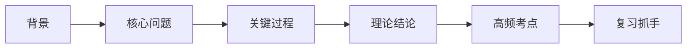
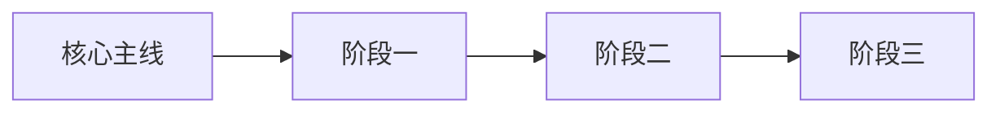

# Course Summary Template

生成最终文档时，优先使用下面这套“课程总结稿”结构。可以按视频内容删减，但不要删除 `标题 -> note -> 思维链 -> 凝练版总览 -> 正文 -> 本节收束` 这条主骨架。

## 标准结构

```markdown
# 标题

> note：
> 2-4 句话说明这节课讲了什么、核心问题是什么、适合谁复习、哪些内容属于二次整理。

## 思维链

> 先用一段话告诉读者：这节课是从什么背景切入、经过哪些关键内容、最后落到什么结论和考点。

主线：
背景 -> 核心问题 -> 关键事件/过程 -> 理论结论 -> 高频考点 -> 复习抓手



## 凝练版总览

> note：
> 用 1-3 句话概括本节最值得先记住的主线、结论或易混点。

### 三句话抓核心

1. …
2. …
3. …

### 结构化速记

| 模块 | 一句话记忆 |
|---|---|
| … | … |
| … | … |



## 一、这节课先抓什么

> note：先告诉读者这一节课最值得优先记住的东西是什么。

用 2-4 段话交代本节的核心任务：

- 这节课到底在讲什么
- 它在整个课程中处于什么位置
- 为什么这一节容易出题
- 复习时应该先抓主线还是先抓细节

## 二、背景与问题

> note：说明这节课为什么会从这里讲起。

这里适合写：

- 历史背景
- 理论背景
- 课程前置知识
- 本节要解决的关键问题

## 三、关键内容展开

> note：这是正文主体，要按课程逻辑详细展开。

推荐按下面方式组织：

### 1. 第一层主线
### 2. 第二层主线
### 3. 关键事件/会议/概念
### 4. 理论结论或现实意义

写法要求：

- 每一小节先点出“这一段在讲什么”
- 再解释“为什么重要”
- 最后提醒“考试可能怎么考”

## 四、时间线 / 事件链 / 逻辑链

> note：这一部分帮助读者把零散知识连成线。

### 时间线

| 时间 | 事件 | 核心内容 | 复习抓手 |
|---|---|---|---|
| … | … | … | … |

### 事件链

事件A -> 事件B -> 事件C -> 理论形成 -> 现实意义

## 五、高频考点与易混点

> note：这里是从“做题”角度回看本节。

| 知识点 | 高频表达 | 常见考法 | 易错提醒 |
|---|---|---|---|
| … | … | … | … |

## 六、这一节该怎么复习

> note：帮助读者把“看懂”转成“会背、会做题”。

建议从这些角度给复习提示：

- 哪几个结论必须背
- 哪几个点只要理解顺序和逻辑
- 哪几组内容最容易混
- 做题时先看什么，再排什么

---

## 本节收束

> 这一节讲到这里，我们已经把“……”这条主线完整梳理完了。

【本节总结到此】

下一步复习建议：
- …
- …
- …
```

## 写作提醒

- 这是一份“课程总结稿”，不是逐字稿，也不是纯摘要。
- 开头的 `思维链` 要帮助读者迅速进入课程结构，不要写成抽象空话。
- 正文尽量用自然段，确实需要并列对比时再用列表或表格。
- 可以详细，但段落必须服务于复习和理解，不能只是把视频内容重新抄一遍。
- 每个大段最好都让读者知道“这一段真正要记什么”。
- 结尾的 `【本节总结到此】` 要保留，作为固定终点标记。
